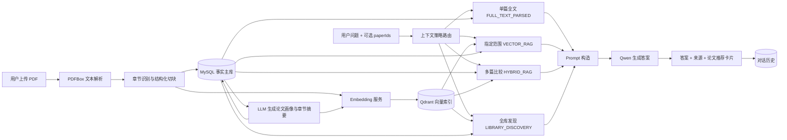
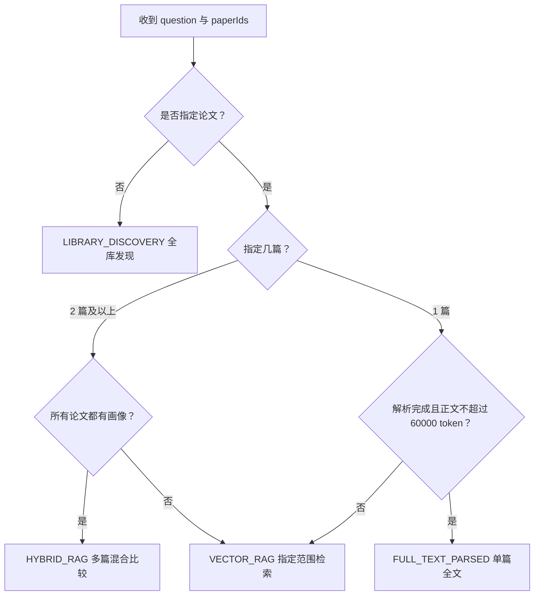
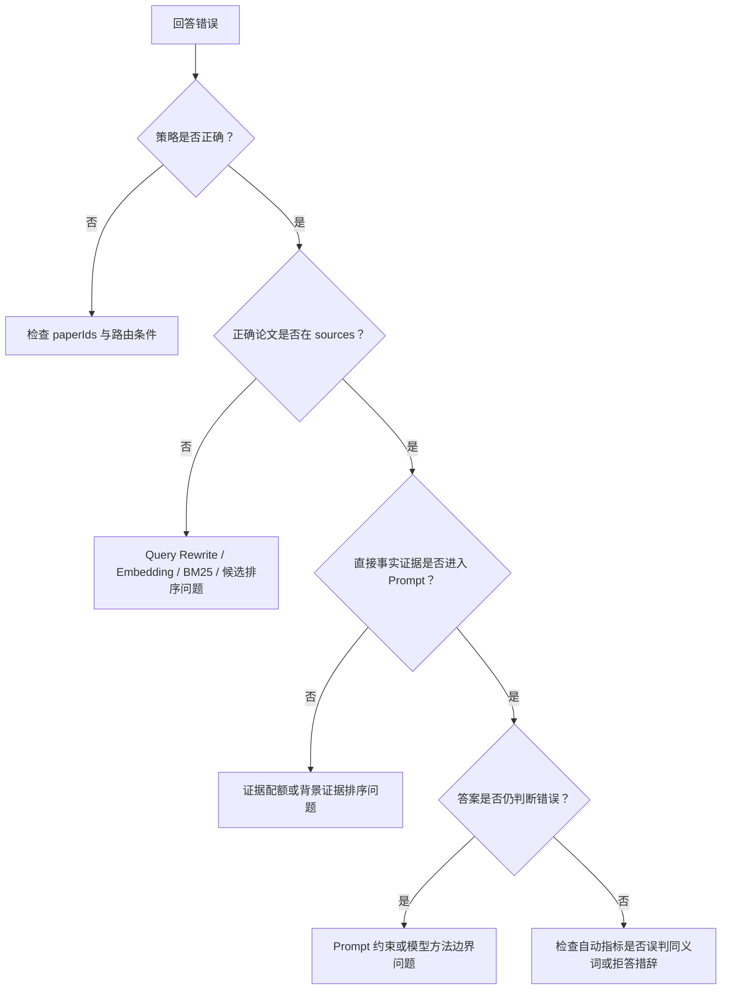

# 论文研究助手 RAG 链路实现与评测完整指南

> 文档版本：2026-07-16  
> 对应语料版本：`rag-corpus-16-v1`（16 篇已解析、已生成画像并完成多粒度向量化的论文）  
> 适用范围：当前项目后端、前端问答与 40 题真实回归评测  
> 说明：本文以当前代码为准，既解释“系统实际怎么运行”，也说明“为什么这样设计、如何量化效果、现阶段还不能证明什么”。

## 1. 先用一句话理解这个项目

本项目是一个面向论文阅读与文献发现的分层 RAG 系统：PDF 经解析、结构化切块后保存到 MySQL，原文块、论文画像和章节摘要同时建立 Qdrant 向量索引；用户提问时，系统根据是否指定论文以及论文数量选择“单篇全文阅读、多篇混合比较、指定范围向量检索或全库论文发现”，再通过 Query Rewrite、向量召回、BM25、RRF、论文级重排和证据配额构造上下文，最终交给大模型生成带来源的回答并保存对话历史。

它不是一条固定的“问题 → Qdrant → 大模型”流水线，而是一个有路由、有多粒度知识、有混合检索和独立评测体系的 RAG 系统。

## 2. 总体架构



系统可以分为两条主链：

1. 离线知识加工链：上传、解析、切块、画像/摘要生成、Embedding、Qdrant 入库。
2. 在线问答链：策略选择、查询改写、检索/取全文、证据组织、Prompt、大模型回答、历史保存。

## 3. 数据分别存在哪里

### 3.1 MySQL：事实主库

MySQL 保存可编辑、可追溯、可恢复的业务数据，主要包括：

| 数据 | 作用 |
| --- | --- |
| 文献元数据 | 标题、作者、年份、文件信息、解析状态等 |
| 章节 | 章节标题、章节类型、章节顺序 |
| 原文块 | chunk 正文、所属章节、引用/噪声标记、结构化版本 |
| 论文画像 | 研究问题、方法概述、实验、贡献、局限、关键词、综合画像文本 |
| 章节摘要 | 章节摘要、关键点、章节类型与摘要版本 |
| 对话历史 | 用户问题、模型回答、模型信息、来源快照、会话关联 |
| Research Idea | 从问答延伸出的研究想法及其来源 |

MySQL 是事实来源。即使 Qdrant 返回了某个 chunk，系统仍会回到 MySQL 读取原文并重新检查 `isReference`、`isNoise` 等字段，避免把向量库中的预览文本当作最终事实。

### 3.2 Qdrant：候选召回索引

Qdrant 不承担完整业务数据管理，而是保存“可以被语义相似度搜索的向量和必要定位信息”。当前统一集合为 `paper_chunks`，距离度量使用 Cosine，相同集合中通过 `contentType` 区分三类知识：

| `contentType` | 向量化内容 | 主要用途 |
| --- | --- | --- |
| `RAW_CHUNK` | 标题 + 章节信息 + 原文块 | 查具体事实、方法细节、实验数据 |
| `PAPER_PROFILE` | 论文综合画像文本 | 判断整篇论文是否与问题相关 |
| `SECTION_SUMMARY` | 章节摘要与要点 | 在论文主题和原文细节之间提供中层证据 |

Qdrant payload 保存 `paperId`、内容记录 ID、章节信息、内容类型、版本号、引用/噪声标记和文本预览等，用于过滤、定位和调试。

### 3.3 为什么画像和摘要既存 MySQL 又存 Qdrant

这不是重复浪费，而是两个不同职责：

- 存 MySQL：便于前端展示、编辑、版本管理、多篇比较时直接读取，以及 Qdrant 丢失后的重建。
- 存 Qdrant：让“没有指定论文”的问题能按论文主题和章节语义发现相关论文。

如果画像和摘要只存在 MySQL，系统仍能在用户已经指定论文时构造多篇比较上下文，但全库发现只能依靠数量很多的原文块，容易发生同一篇论文的多个高分块占满 TopK、其他相关论文无法进入候选的问题。

因此当前合理的数据关系是：

```text
MySQL = 权威数据和业务状态
Qdrant = 可重建的检索索引
paperId / chunkId / profileId / summaryId = 两者之间的定位键
```

## 4. 离线知识加工链路

### 4.1 PDF 解析

后端使用 PDFBox 加载 PDF，并通过 `PDFTextStripper` 提取文本。当前适合原生文本型 PDF；扫描件没有 OCR 文字层时，解析质量会明显下降，这是当前能力边界。

解析成功后会更新文献解析状态，并进入章节识别和结构化切块。

### 4.2 章节识别与结构化切块

切块不是简单固定长度截断，而是先识别章节，再在章节内按段落组合：

- 目标长度约 1600 字符；
- 最大长度约 2200 字符；
- 相邻块重叠约 200 字符；
- 索引文本会拼入论文标题、章节类型、章节标题和正文；
- token 数按约 `字符数 / 4` 估算；
- 参考文献、附录或低价值内容会被标记为 `isReference` / `isNoise`；
- 当前结构化策略版本为 `paper-structure-v1`。

加入标题和章节元数据的原因是：只向量化局部正文时，“本文提出的方法”这类句子缺少论文与章节语境；补充元数据后，语义召回更稳定。

### 4.3 原文块向量化

每个可用 chunk 调用 Embedding 服务得到向量，然后写入 Qdrant 的 `RAW_CHUNK` 类型点。向量库保存定位 payload，完整原文仍以 MySQL 为准。

### 4.4 画像与章节摘要生成

LLM 基于论文结构化内容生成：

- 论文画像：研究问题、方法、实验、贡献、局限、关键词和可检索的综合画像文本；
- 章节摘要：按章节保存摘要和关键点。

生成结果先写 MySQL。这样前端可以显示画像状态，用户也能直接使用这些结构化信息。

### 4.5 画像与摘要向量入库

“生成画像”和“向量入库”是两个不同状态：生成成功只说明 MySQL 有数据；索引成功才说明 Qdrant 可以检索它。

索引服务将画像写为 `PAPER_PROFILE`，将章节摘要写为 `SECTION_SUMMARY`。前端已有相应状态与操作能力，用于判断某篇论文是否完成多粒度索引。

完整准备状态应理解为：

```text
PDF 已解析
  + 原文 chunk 已进入 Qdrant
  + 画像/摘要已在 MySQL 生成
  + 画像/摘要已进入 Qdrant
= 可同时支持全文精读、多篇比较和全库论文发现
```

## 5. 在线问答的入口

核心接口为：

- `GET /api/rag/sources`：只检索来源，适合调试召回。
- `POST /api/rag/chat`：完成历史追问改写、策略路由、上下文构造、LLM 回答和历史保存。
- `POST /api/rag/chat/stream`：执行同一链路，并通过 SSE 增量返回元数据、正文和完成事件。

`RagChatRequest` 的关键字段：

| 字段 | 含义 |
| --- | --- |
| `question` | 用户问题 |
| `topK` | 最终来源预算，默认 5；正式评测使用 12 |
| `paperIds` | 新的多选论文范围，优先级高于旧字段 |
| `paperId` | 兼容旧版的单篇论文 ID |
| `sessionId` | 继续已有会话 |

返回结果除答案外，还包括来源、使用的策略、实际检索问题 `retrievalQuestion`、上下文 token 估算、上下文论文 ID、模型信息、会话 ID，以及全库发现时的论文相关度卡片。

## 6. 四种上下文策略如何选择



### 6.1 `FULL_TEXT_PARSED`：单篇全文精读

适用条件：只指定一篇论文、解析状态完成、存在可用正文块，且估算正文不超过默认 60000 token 预算。

这条路径不需要先做向量 TopK。系统从 MySQL 按章节和顺序组装整篇可用正文，排除引用和噪声，然后构造全文 Prompt。

优点是不会因为 TopK 丢掉论文后半部分，适合“解释这篇论文的方法”“总结实验”等单篇阅读问题。超出预算时回退到 `VECTOR_RAG`。

### 6.2 `VECTOR_RAG`：指定范围内的块级检索

适用于单篇正文过长、单篇条件不完整，或多篇论文缺少画像时的回退路径。

检索只在用户指定的 `paperIds` 范围内进行，主要检索 `RAW_CHUNK`，并通过 MySQL 二次过滤。它强调局部事实召回，不依赖完整画像体系。

### 6.3 `HYBRID_RAG`：多篇论文比较

适用于用户明确选择两篇及以上、且每篇都有 `paper-profile-v1` 画像的情况。

每篇论文的上下文由三层组成：

1. 一份论文画像，帮助模型先理解研究问题和总体方法；
2. 最多 4 个与问题类型相关的章节摘要；
3. 最多 2 个向量/BM25 检索到的原文证据块。

章节摘要会根据问题中的“方法、实验、结果、局限”等词调整优先级。Prompt 要求模型先分别分析每篇论文，再做横向比较，从而减少把 A 论文的方法错配给 B 论文。

### 6.4 `LIBRARY_DISCOVERY`：未指定论文的全库发现

这是当前检索优化的重点。用户问“哪些论文使用图神经网络”“哪篇研究光伏功率”时，并不知道 paperId，系统必须先从整个文献库找出候选论文，再组织证据回答。

完整链路为：

```text
用户问题
→ 高级 Query Rewrite
→ 画像 / 摘要 / 原文三类独立向量召回
→ BM25 关键词召回
→ 各通道 RRF 融合
→ paperId 级候选聚合与重排
→ 按问题意图动态截断候选论文
→ 每篇论文分配画像 + 事实证据
→ 全库发现 Prompt
→ 答案与论文推荐卡片
```

## 7. Query Rewrite 是怎么做的

### 7.1 普通向量路径

普通 `VECTOR_RAG` 遇到中文问题时，会调用一次 LLM，把它改写为英文科研检索表达；英文问题保持原样。如果改写失败则使用原问题，不让外部模型异常阻断问答。

### 7.2 全库发现路径

`AdvancedQueryRewriteService` 用一次 LLM 调用生成 JSON，包含：

- `declarativeQuery`：英文陈述式学术查询；
- `keywordQuery`：由 3—7 个关键术语组成的查询；
- `keywordTerms`：后续论文重排可解释地使用的术语列表；
- `hydeQuery`：2—4 句“假想相关论文摘要”，即 HyDE 查询。

三种查询去重后共同参与召回。其作用不同：陈述式查询覆盖问题语义，关键词查询保护 VMD、CEEMD、ARIMA 等术语，HyDE 缩小用户口语问题与论文摘要风格之间的表达差距。

## 8. 混合检索与融合排序

### 8.1 Dense Retrieval

Embedding 将查询转成向量，在 Qdrant 中按 Cosine 相似度召回。全库发现会对同一条改写查询只计算一次向量，然后复用该向量分别搜索 `PAPER_PROFILE`、`SECTION_SUMMARY`、`RAW_CHUNK`，避免三类检索重复调用 Embedding。

### 8.2 BM25

系统在 MySQL 的可用原文块上建立内存 BM25 索引，参数为：

```text
k1 = 1.5
b  = 0.75
```

BM25 擅长精确匹配缩写和专业术语，弥补向量模型可能把含义相近但技术路线不同的内容混在一起的问题。它同样遵守 paperId 范围，并过滤引用和噪声块。

### 8.3 RRF 融合

向量通道和 BM25 的原始分数不可直接比较，因此使用 Reciprocal Rank Fusion，只依赖每个候选在各通道中的名次：

```text
RRF(d) = Σ 1 / (60 + rank_i(d))
```

其中 `rank_i(d)` 是文档 `d` 在第 `i` 条检索结果中的排名，常量 `60` 用于减弱不同排名列表的尺度差异。一个证据若在原问题、改写问题和 BM25 中都靠前，其融合分数就更高。

### 8.4 为什么全库发现要分内容类型召回

旧方案把画像、摘要和原文放在一个共享 TopK 中。由于每篇论文有很多原文块、只有一份画像，同一篇论文的多个原文块容易挤满 TopK，导致相关论文的画像没有机会出现。

当前方案先建立三个独立候选池，各自完成 RRF，再按 paperId 聚合。因此画像负责“这篇论文整体是否相关”，摘要和原文负责“是否有事实支持”，不会再单纯由块数量决定论文曝光。

## 9. 论文级候选聚合与重排

设论文 `p` 在内容类型 `t` 下有若干条证据，取最佳与次佳证据，类型权重为：

```text
画像 PAPER_PROFILE   = 0.40
摘要 SECTION_SUMMARY = 0.35
原文 RAW_CHUNK        = 0.25
```

当前论文级分数可概括为：

```text
typeScore(p,t) = min(1, (best_t + 0.25 × second_t) / maxScore_t)

paperScore(p) = Σ weight_t × typeScore(p,t)
              + 0.05 × (命中的内容类型数 - 1)
              + 0.20 × 明确查询术语覆盖率
              - 综述惩罚
```

设计含义如下：

- 同类型第二条证据只有 25% 的边际贡献，防止靠堆很多相似 chunk 取胜；
- 同时被画像、摘要、原文命中会获得多粒度奖励；
- 明确术语覆盖从摘要和原文事实证据计算，不从画像的宽泛描述虚增；
- 用户未主动询问综述时，标题含 review、survey、综述的论文扣 0.30，避免综述挤掉原创方法论文；如果问题本身就在找综述，则不扣分。

## 10. 动态候选截止

系统不会机械地给每个问题都返回 6 篇。它先得到最多 8 篇宽候选，再识别问题意图：

| 问题类型 | 例子 | 候选策略 |
| --- | --- | --- |
| 唯一目标 | “唯一哪篇研究光伏” | 优先术语覆盖率，通常只保留 1 篇 |
| 单目标 | “哪一篇使用 ERA5” | 最多 3 篇，使用较高相对分数阈值 |
| 双目标 | “哪篇做长期、哪篇做中期” | 至少保留 2 篇 |
| 列举型 | “哪些论文使用图结构” | 最多 6 篇，阈值更宽 |
| 普通发现 | 一般主题检索 | 最多 4 篇 |

候选还必须达到相对于第一名的分数阈值。这个机制解决了“单答案问题为了凑满 TopK 携带五篇干扰论文”的问题，在召回率和精确率之间建立可解释的平衡。

## 11. 最终证据如何分配

确定候选论文后，不是直接取全局分数最高的若干块，而是按论文做覆盖配额：

1. 第一轮：每篇论文优先放一条画像；
2. 第二轮：每篇论文放一条章节摘要或原文事实证据；
3. 还有预算时：按 paperId 轮询补充剩余证据。

事实证据排序还会区分：

- 直接方法证据：包含“本文提出、构建图、邻接矩阵、节点”等直接描述；
- 背景证据：只在 related work 中讨论 existing/current methods，而没有本文方法标记。

直接方法证据优先，避免模型只看到“现有 GNN 的局限”，却看不到本论文真正如何构图。

## 12. Prompt 与答案生成

四条策略使用不同 Prompt，但遵循共同约束：

- 只能依据给定上下文回答；
- 缺少证据时明确说明不能确认，不能编造；
- 引用来源编号与 `paperId` 是两个概念，不得把 `[来源 9]` 写成“论文 9”；
- 多篇比较先分论文说明，再总结异同；
- 全库发现需要列出相关论文及理由；
- 图片、公式或数据不在上下文中时不能凭常识补全。

LLM 生成完成后，系统返回答案及 `sources`。全库发现还通过 `PaperDiscoveryService.aggregateByPaper` 生成最多 6 张论文相关度卡片，供前端展示。这一展示层聚合与检索阶段的候选重排目的不同：前者用于显示最终来源论文，后者决定哪些论文能够进入 Prompt。

## 13. 对话历史与 Research Idea

### 13.1 历史感知追问

当请求携带 `sessionId` 且问题包含“它、二者、上述、其中”等依赖历史的表达时，`HistoryAwareQueryService` 读取最近 6 条消息，并调用 LLM 将追问改写为可独立检索的问题。明确包含论文 ID 或标题的完整问题直接跳过改写；历史读取或模型调用失败时回退到原问题，不阻断 RAG。

检索、Prompt 和答案生成使用 `retrievalQuestion`，历史记录仍保存用户实际输入的原问题。这样既能让连续追问命中正确论文，也不会把模型生成的改写文本冒充用户输入。同步接口和 SSE 元数据都会返回实际检索问题，前端仅在发生改写时展示“原始追问 / 实际检索”。

### 13.2 历史保存与 Idea

每次问答会保存：

- 会话 ID；
- 用户问题和模型答案；
- provider 与模型名；
- 本轮来源快照；
- 单篇问答时的 paperId。

多篇或全库问答不会硬塞进单个历史 `paperId` 字段，而是将其置空，来源关系保存在 source 快照中。系统还会判断答案是否值得保存为 Research Idea，并返回建议和理由。

需要注意：当前前端评测页面展示的是固定终验快照，并不会根据普通聊天历史自动重算指标。历史回答用于对话与来源追溯，正式评测必须由回归脚本按固定问题集重新执行。

## 14. 评测目标与基本原则

本项目的评测不是只看“答案读起来像不像对”，而是拆成五层：

1. 可用性：接口能否成功完成；
2. 路由正确性：是否走了预期的上下文策略；
3. 检索正确性：相关论文有没有被召回、干扰论文有多少；
4. 证据质量：是否越界、是否混入参考文献或噪声、是否使用多粒度证据；
5. 生成质量与性能：关键事实是否覆盖、无答案时是否拒答、延迟是否可接受。

这样可以区分故障究竟发生在“没找到论文”“找到了但证据选错”“证据正确但模型判断错”还是“自动评测规则误判”。

## 15. 当前正式评测集

当前固定回归集包含 16 篇论文和 40 道题：

| 类别 | 数量 | 主要验证内容 | 预期策略 |
| --- | ---: | --- | --- |
| 单篇精读 | 16 | 每篇论文的方法与关键事实 | `FULL_TEXT_PARSED` |
| 多篇比较 | 8 | 多论文归属、对比和范围隔离 | `HYBRID_RAG` |
| 全库发现 | 10 | 未指定论文时的发现与推荐 | `LIBRARY_DISCOVERY` |
| 困难负例 | 4 | 相似论文辨析、唯一目标、干扰项 | 混合/全库 |
| 无答案负例 | 2 | 量子纠错、临床 CT 等库外问题 | `HYBRID_RAG` |

评测环境使用真实 Qwen 生成、真实 Embedding、Qdrant 和 MySQL，`topK=12`，40 题顺序执行，避免并发限流对结果造成额外干扰。

## 16. 每个指标如何计算

### 16.1 执行成功率

```text
Execution Success Rate = 成功返回的题数 / 总题数
```

只表示系统可用，不代表答案正确。

### 16.2 策略准确率

```text
Strategy Accuracy = 实际策略等于预期策略的题数 / 成功题数
```

用于检查路由是否把单篇、多篇、全库问题送到正确链路。

### 16.3 论文召回率

对每道有标准论文集合的题：

```text
Recall = |标准论文 ID ∩ 来源论文 ID| / |标准论文 ID|
```

召回率高说明应该找到的论文基本找到了。例如标准答案有 5 篇，系统来源包含其中 4 篇，Recall 为 80%。

### 16.4 论文精确率

```text
Precision = |标准论文 ID ∩ 来源论文 ID| / |来源论文 ID|
```

精确率高说明混入的无关论文少。例如系统返回 4 篇，只有 3 篇正确，Precision 为 75%。

报告中的总体 Recall/Precision 是“先逐题计算，再对适用题做宏平均”，不是把所有论文命中数合并后的微平均，因此每道题权重相同。

### 16.5 推荐卡片 Recall / Precision

使用 `paperRelevance` 中的论文 ID 按同样公式计算。它只应重点观察全库发现类别，因为单篇和多篇路径本来就不生成推荐卡片；不能把其他类别的空卡片误解为推荐失败。

### 16.6 指定范围纯度

```text
Scope Purity = 来源中属于用户指定 paperIds 的数量 / 来源总数
```

它验证多篇比较是否偷偷混入未选择论文。当前指定范围问题目标为 100%。

### 16.7 参考文献/噪声污染率

```text
Reference Noise Rate
= (isReference=true 或 isNoise=true 的来源数) / 来源总数
```

目标为 0%。这能避免模型把参考文献标题、出版信息或解析乱码当作正文结论。

### 16.8 答案关键词覆盖率

每道题预先设置少量核心关键词：

```text
Keyword Coverage = 答案命中的预期关键词数 / 预期关键词总数
```

它适合稳定回归“关键概念有没有丢”，但不等于完整语义正确率。模型即使提到关键词，也可能归属错误；反过来，使用正确同义词也可能被字符串匹配漏判。

### 16.9 拒答准确率

对 `expectRefusal=true` 的问题，检测回答是否明确表示文献中没有证据：

```text
Refusal Accuracy = 正确拒答题数 / 应拒答题数
```

自动检测依赖措辞规则，必须保留人工复核。最终原始 JSON 的自动结果为 50%，但人工确认两题都明确回答“无一篇文献涉及”，实际为 2/2 正确拒答；脚本随后补充了“无一篇”表达，原始结果未被回写，以保证评测不可篡改。

### 16.10 严格三粒度使用率

只对全库发现题统计：如果最终 sources 同时包含 `paper_profile`、`section_summary`、`raw_chunk`，该题记为 1，否则为 0。

```text
Multi-granularity Rate = 同时使用三类来源的发现题数 / 发现题数
```

它验证画像和摘要确实参与了检索链，而不是仅仅“已经存在 Qdrant”。

### 16.11 延迟

每题从请求开始到完整响应结束记录毫秒数，然后统计：

- Average：平均延迟；
- P50：一半请求不超过该值；
- P95：95% 请求不超过该值。

完整延迟包含历史追问改写、Query Rewrite、Embedding、检索、数据库读取、Prompt 构造和 Qwen 生成。SSE 评测还单独记录首段正文时间；P95 和完整时间会明显受到模型输出长度和外部服务波动影响。

## 17. 当前最终量化结果

### 17.1 优化前后对比

| 指标 | 优化前基线 | 最终 40 题 | 变化 |
| --- | ---: | ---: | ---: |
| 总体 source 论文 Recall | 95.35% | 99.12% | +3.77 个百分点 |
| 总体 source 论文 Precision | 96.18% | 96.49% | +0.31 个百分点 |
| 全库发现 Recall | 82.33% | 96.67% | +14.34 个百分点 |
| 全库发现 Precision | 93.00% | 91.67% | -1.33 个百分点，仍高于 90% 门槛 |
| 全库推荐卡片 Recall | 未单独统计 | 96.67% | 新增指标 |
| 全库推荐卡片 Precision | 未单独统计 | 91.67% | 新增指标 |
| 严格三粒度使用率 | 10.00% | 70.00% | +60.00 个百分点 |
| 策略准确率 | 100% | 100% | 持平 |
| 指定范围纯度 | 100% | 100% | 持平 |
| 引用/噪声污染率 | 0% | 0% | 持平 |
| 答案关键词覆盖率 | 93.42% | 96.93% | +3.51 个百分点 |
| 平均延迟 | 21.582 秒 | 23.265 秒 | +1.683 秒 |
| P95 延迟 | 34.947 秒 | 48.098 秒 | +13.151 秒 |

核心结论是：这轮优化确实提升了全库论文发现能力，Recall 从 82.33% 提升到 96.67%，同时 Precision 仍保持 91.67%，并显著提高画像、摘要、原文三层知识的实际利用率。

不能声称延迟得到优化。完整 P95 上升主要由真实 Qwen 的多篇长回答波动主导；本轮检索优化只改 `LIBRARY_DISCOVERY`，没有给单篇和多篇链路增加检索或 LLM 调用。全库发现自身平均/P95 为 14.578/23.494 秒。

### 17.2 分类结果

| 类别 | 题数 | Recall | Precision | 关键词覆盖 | 平均 / P95 延迟 |
| --- | ---: | ---: | ---: | ---: | ---: |
| 单篇精读 | 16 | 100% | 100% | 95.83% | 19.034 / 29.450 秒 |
| 多篇比较 | 8 | 100% | 100% | 100% | 39.715 / 48.841 秒 |
| 全库发现 | 10 | 96.67% | 91.67% | 95.00% | 14.578 / 23.494 秒 |
| 困难负例 | 4 | 100% | 87.50% | 100% | 23.198 / 33.535 秒 |
| 无答案负例 | 2 | 人工拒答 100% | 不适用 | 不适用 | 34.886 / 35.031 秒 |

## 18. 如何复现评测

前提：IDEA 中后端已启动，MySQL、Qdrant、Qwen API 和 Embedding 配置可用，16 篇语料状态与评测集一致。

在项目根目录使用 PowerShell：

```powershell
$env:RAG_EVAL_CASES_FILE='rag-evaluation-cases-16.json'
$env:RAG_EVAL_OUTPUT_FILE='test/results/rag-evaluation-local.json'
node test/run-rag-evaluation.mjs
```

只回归指定题目：

```powershell
$env:RAG_EVAL_CASE_IDS='D-GRAPH,D-DECOMPOSITION,D-PV'
node test/run-rag-evaluation.mjs
```

脚本支持通过环境变量调整后端地址、TopK、用例文件、输出文件和用例 ID。正式对比时必须固定：

- 同一语料快照；
- 同一用例文件；
- 同一 TopK；
- 同一指标代码；
- 同样的顺序/并发方式。

否则优化前后数字没有严格可比性。每次运行的完整答案与 sources 都写入 JSON，后续可定位究竟是哪篇论文、哪种来源、哪个回答造成指标变化。

## 19. 怎样阅读一次失败

推荐按下面顺序排查：



这种分层分析比“看到答案错就继续加检索规则”更可靠，也能避免无限针对单题硬编码。

## 20. 已知限制

1. 当前只有 16 篇开发语料，足以用于功能回归和简历项目量化，但不能代表数百或数千篇生产文献库。
2. PDFBox 不提供 OCR，扫描 PDF、复杂双栏、公式和图表可能解析不完整。
3. Embedding 与 Query Rewrite 是外部模型，真实召回存在单轮波动。
4. D-GRAPH 中检索和推荐覆盖标准论文 5/5，但 Qwen 将论文 30 的条件局部卷积解释为非图模型，属于方法分类边界/生成判断问题。
5. D-DECOMPOSITION 最终轮次为 4/6，定向轮次曾达到 5/6，说明真实向量检索有波动；宏平均仍达到停止门槛。
6. 关键词覆盖不能证明逻辑、数值和论文归属完全正确，关键演示题和拒答题仍需要人工审计。
7. 当前 token 主要按字符数估算，并非模型 tokenizer 的精确计数。
8. 完整回答不是流式输出，多篇比较的长答案使等待时间偏高。
9. 前端评测页是固定结果快照，不是生产监控平台，也不会自动从历史问答推导“实时准确率”。

## 21. 当前停止条件与后续扩展

本轮检索优化的停止门槛为：

- 全库发现 Recall ≥ 90%；
- 全库发现 Precision ≥ 90%；
- 策略准确率、范围纯度和噪声过滤不得退化。

最终已经达到 96.67% / 91.67%，因此不再围绕个别问题继续堆启发式规则。

未来扩充到 50 篇以上时，应重新建立大语料基线：增加跨主题干扰论文、同名术语、近似方法、年份/作者筛选、无答案问题和长尾问题，再复用同一套宏平均指标。不能直接把 16 篇语料上的 96.67% 当成大规模文献库指标。

若进入生产化阶段，后续重点应是：

- 增加 OCR 与复杂 PDF 解析质量评测；
- 用精确 tokenizer 管理上下文预算；
- 对生成答案增加论文级事实一致性或 LLM-as-Judge 辅助指标，并保留人工抽查；
- 在真实断线或并发压力出现后，再评估取消传播、断线续传与限流；
- 建立索引版本、语料版本、评测版本之间的可追溯关系；
- 当语料显著扩张后，再评估 Qdrant 索引参数和两阶段 reranker，而不是现在继续调规则。

## 22. 代码与材料索引

| 主题 | 文件 |
| --- | --- |
| RAG 总编排 | `backend/research-assistant-backend/src/main/java/com/myagent/assistant/rag/service/impl/RagChatServiceImpl.java` |
| 策略选择 | `backend/research-assistant-backend/src/main/java/com/myagent/assistant/rag/service/impl/ContextStrategyServiceImpl.java` |
| 检索、BM25、RRF、证据配额 | `backend/research-assistant-backend/src/main/java/com/myagent/assistant/rag/service/impl/RagRetrievalServiceImpl.java` |
| 论文级聚合与动态候选 | `backend/research-assistant-backend/src/main/java/com/myagent/assistant/rag/service/impl/PaperDiscoveryServiceImpl.java` |
| 高级 Query Rewrite | `backend/research-assistant-backend/src/main/java/com/myagent/assistant/rag/service/impl/AdvancedQueryRewriteServiceImpl.java` |
| 历史感知追问改写 | `backend/research-assistant-backend/src/main/java/com/myagent/assistant/rag/service/impl/HistoryAwareQueryServiceImpl.java` |
| 多篇上下文 | `backend/research-assistant-backend/src/main/java/com/myagent/assistant/rag/service/impl/HybridRagContextServiceImpl.java` |
| 单篇全文上下文 | `backend/research-assistant-backend/src/main/java/com/myagent/assistant/rag/service/impl/FullTextContextServiceImpl.java` |
| Prompt 构造 | `backend/research-assistant-backend/src/main/java/com/myagent/assistant/rag/service/impl/RagPromptServiceImpl.java` |
| Qdrant 访问 | `backend/research-assistant-backend/src/main/java/com/myagent/assistant/qdrant/service/QdrantService.java` |
| 40 题用例 | `test/rag-evaluation-cases-16.json` |
| 评测脚本 | `test/run-rag-evaluation.mjs` |
| 多轮评测脚本 | `test/run-rag-multiturn-evaluation.mjs` |
| 最终原始结果 | `test/results/rag-evaluation-16-final-stage3-2026-07-16.json` |
| 最终量化报告 | `docs/evaluation/reports/final-16-paper-2026-07-16.md` |
| 多轮评测报告 | `docs/evaluation/reports/rag-multiturn-2026-07-16.md` |

## 23. 面试或项目介绍时怎么讲

可以按“问题—方案—量化”三段讲：

> 项目最初把论文画像、章节摘要和原文块放在同一个向量 TopK 中检索，原文块数量多，容易造成同一篇论文占满候选，导致全库发现漏掉其他相关论文。我将问答链按单篇全文、多篇混合和全库发现进行策略路由，在全库路径中加入多查询改写、Dense + BM25、RRF 融合，并把三类内容分池召回，再按 paperId 使用画像 0.40、摘要 0.35、原文 0.25 的权重聚合，结合动态候选截止和每篇论文证据配额构造 Prompt。最后构建 16 篇论文、40 道真实 Qwen/Qdrant 回归集，分别统计召回率、精确率、范围纯度、噪声率、多粒度使用率、关键词覆盖和延迟，将全库发现 Recall 从 82.33% 提升到 96.67%，Precision 保持 91.67%，多粒度证据使用率从 10% 提升到 70%。

这段描述没有夸大为“答案 100% 正确”，也没有声称延迟优化，和当前真实评测证据一致。
