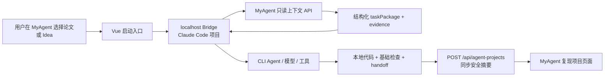

# Research Engineering Agent：文献复现与 Idea 代码改进

> 集成性质：本能力由 MyAgent 与一个独立的 Claude Code / Research Engineering Agent 项目联合实现。MyAgent 仓库不包含完整的本地 Agent 运行时。

## 这项功能解决什么问题

MyAgent 原本负责管理文献、RAG 问答和研究 Idea。本功能在“阅读/形成想法”之后增加一个本地代码执行入口：用户可以让本地 Research Engineering Agent 完成两类事情。

1. 选中一篇文献后，生成该文献的可运行最小复现代码。
2. 选中一个 Idea 后，在用户指定的已有本地代码目录中，按该 Idea 做一次聚焦的代码改进。

它不替用户做研究实验、调参或评价论文结论；它交付的是可阅读、可运行检查的代码基础和清楚的交接说明。

## 两个项目如何分工

| 组件 | 所属项目 | 职责 |
| --- | --- | --- |
| 文献、画像、章节摘要、Idea | MyAgent | 保存科研资料并提供可追溯事实 |
| 上下文 API 与 `taskPackage` | MyAgent | 把论文或 Idea 整理为稳定、只读的代码任务契约 |
| 文献/Idea 页面与“复现项目”页面 | MyAgent | 提供启动入口和安全的项目状态摘要 |
| localhost Bridge | Claude Code / Research Engineering Agent 项目 | 接收网页请求、选择或创建本地工作区、补充仓库基线 |
| CLI Agent、模型与工具调用 | Claude Code / Research Engineering Agent 项目 | 阅读任务包、修改代码、执行短检查并生成交接 |
| 本地完整日志与版本摘要 | Claude Code / Research Engineering Agent 项目 | 保存上下文快照、journal、handoff 和版本检查点 |

因此，MyAgent 是“科研上下文与控制面”，Claude Code 项目是“本地代码执行面”。两边通过 HTTP 上下文接口、localhost Bridge 和项目状态同步接口连接，而不是把本地代码执行塞进 Spring Boot 进程。



## 用户使用流程

### 文献复现

1. 在文献页面选择一篇论文，点击“复现代码”。
2. MyAgent 整理该论文的摘要、画像和关键章节证据。
3. 本地 Agent 在独立的论文工作目录创建代码、入口和基础检查。
4. CLI 窗口显示真实的模型与工具步骤；用户可在同一个窗口继续要求修改。
5. 每轮结束后，摘要同步回 MyAgent 的 Agent 项目列表。

### Idea 代码改进

1. 在 Idea 页面选择一个 Idea，点击“按 Idea 改进代码”。
2. 用户选择一个已有的本地代码目录；该目录与这个 Idea 建立本机对应关系。
3. 本地 Agent 先阅读已有代码，再只在允许范围内完成一次聚焦改进和基础检查。
4. 后续继续同一个 Idea 时，Agent 读取该工作目录中的上下文快照、版本摘要和历史交接，而不是从零理解需求。

这里的“按 Idea 复现”在产品页面中实际指 **Idea 驱动的代码改进**：它必须基于用户选择的已有仓库，不会脱离现有代码从零声称复现一个研究想法。

## 结构化任务包

网页系统不会把零散的论文文字或聊天记录直接塞给模型，而是通过只读接口返回 `taskPackage`：

| 字段 | 含义 |
| --- | --- |
| `taskType` | 论文复现或 Idea 代码改进 |
| `goal` | 本轮要交付的代码目标 |
| `implementationSteps` | 有序的实施步骤 |
| `interfaces` / `parameters` | 已知的输入输出边界、参数及来源 |
| `evidence` | 可追溯的论文或 Idea 证据 |
| `assumptionsAndGaps` | 缺失信息，不能被模型悄悄当作事实 |
| `codeScope` | 可改与不可改的路径范围 |
| `acceptanceChecks` | 只用于确认代码能基本运行的短检查 |

在线 MyAgent 只提供科研事实，不知道也不保存用户本机绝对路径。本地 Bridge 拿到任务包后，才把用户选择目录的 `RepositoryBaseline`（允许路径、禁止路径、已有检查命令）补进去。

### Agent Context v2

论文复现接口默认使用 `agent-context-v2`。v2 在保留 v1 全部字段的基础上新增：

- 持久化 `reproductionSpec`，明确可信事实、待复核内容、模型推断、冲突和缺口；
- 关键方法/实验原文直接作为 `paper_raw_chunk` evidence，不再只依赖章节摘要转述；
- 可信事实作为 `paper_reproduction_fact` evidence，并携带来源类型、来源 ID、页码、验证状态和置信度；
- `taskPackage` 固定要求 handoff 分开说明“证据支持的实现、模型推断、安全默认值、冲突和缺失信息”。

旧本地 Agent 可请求 `?version=1`；它仍能读取原有论文、evidence 和任务包字段。v2 是增量协议，不会改变 v1 字段语义。

## Agent 的专用约束

为了适合科研工程场景，Agent 对每个准备执行的动作遵循以下规则：

- 有证据支持：可以实现；
- 论文/Idea 没有给全但存在安全默认值：可以实现，但必须在交接中标注为假设；
- 缺少关键依据：明确标记为阻塞，而不是编造算法细节。

Idea 模式还有实际的权限约束：即使模型尝试写入目录外文件，权限管道也会拒绝该工具调用。基础检查只能是编译、导入、短单测或 smoke run，不能自动下载数据、安装依赖、跑实验、调参、Git 合并或推送。

在 Idea 首次启动前，本地端还会确定性扫描用户选中的仓库：识别 Python、Maven、Node 项目线索、Git 修订信息、可写源路径和基础检查候选。扫描结果形成 `RepositoryBaseline`，因此模型不必先猜测项目结构。

## 接口与本地边界

```text
GET /api/papers/{id}/reproduction-context?version=2
GET /api/papers/{id}/reproduction-context?version=1
GET /api/papers/{id}/reproduction-spec
POST /api/papers/{id}/reproduction-spec/rebuild
GET /api/research-ideas/{id}/improvement-context
GET /api/agent-projects
POST /api/agent-projects
```

前两个上下文接口都是只读接口，返回 `sourceRevision`、原始对象、证据和 `taskPackage`。后两个接口只保存和查询项目卡片及最近活动摘要。本地 Bridge 创建或选择工作目录；MyAgent 服务端不执行用户代码，也不接收本机绝对路径、密钥或代码文件。

### localhost Bridge 接口

网页当前使用的本地契约包括：

```text
POST /v1/paper-projects
POST /v1/paper-projects/{paperId}/run
GET  /v1/paper-projects/{paperId}/run
POST /v1/idea-projects/{ideaId}/select-workspace
GET  /v1/idea-projects/{ideaId}/selection-status
POST /v1/idea-projects/{ideaId}/run
```

这些路由由独立 Claude Code / Research Engineering Agent 项目提供，不是 Spring Boot 后端接口。浏览器只允许 `http://127.0.0.1` 或 `http://localhost` Bridge 地址；论文准备请求支持一次性 Token，Token 不发送给 MyAgent 且成功后从页面状态清除。

## 项目状态语义

| 状态 | 含义 |
| --- | --- |
| `CONTEXT_READY` | 上下文和工作区已准备，尚未开始代码交付 |
| `RUNNING` | 当前 Agent 代码交付正在执行 |
| `CHAT_READY` | 首轮交付摘要已生成，同一 CLI 窗口等待用户继续修改 |
| `PAUSED` | 达到安全轮数或需要用户补充信息，可继续原项目 |
| `COMPLETED` | 当前会话已结束，产物保留在本地 |
| `FAILED` | 当前轮失败，但仍生成恢复交接与已完成文件清单 |

## 可追溯性

每个本地项目保存不可变的上下文快照、代码交接摘要和版本检查点。交接中会说明：修改过哪些文件、实际执行了什么基础检查、哪些部分由证据支持、哪些部分是假设，以及用户后续应自行运行哪些实验或完整测试。

每轮交付除 Markdown 摘要外还会生成机器可读的 `session-XXXX.json` handoff，固定记录项目/会话身份、状态、轮数、请求、创建/修改/删除文件和下一步。即使模型异常或达到安全轮数上限，也会生成该 handoff 与版本检查点，状态同步为 `FAILED` 或 `PAUSED`，可在同一工作目录继续。

同时，MyAgent 系统端会在 `ResearchAssistantData/agent-projects.json` 保存一份不含本机绝对路径的项目索引与活动流水。每个同步事件包含项目 ID、文献/Idea 来源 ID、模式、状态、会话 ID、版本号、上下文修订号、相对交接摘要路径和摘要。系统端按 `sourceId + mode` 归并同一项目，最多保留 50 条活动；本地端保留完整细节。写入采用临时文件再原子替换，避免程序中断造成记录文件写坏。

```text
本地完整记录：context snapshot + journal events + version summaries
                  │  只同步安全、可追溯的索引信息
                  ▼
MyAgent 系统记录：Agent project card + activityLog（最近 50 条）
```

MyAgent 以 `sourceId + mode` 归并同一来源的项目卡片；论文页面不会因为本地临时 workspace ID 变化而重复展示同一复现项目。

### 证据决策层

Context v2 到达本地后不再只是拼进提示词。Agent 先类型化校验 `ReproductionSpec`，再把准备状态转成执行策略：`READY` 可按证据实现，`PARTIAL` 只实现可信部分，`NEEDS_REVIEW` 不得静默选择冲突项，`NOT_READY` 则在调用模型前暂停。

完整规格和不可变快照保存在本地，首轮提示只带紧凑索引；模型需要细节时通过只读 `query_reproduction_evidence` 查询。查询默认只返回可信事实，待复核、模型推断和冲突内容必须显式按非权威数据读取。论文正文和所有检索结果都被标记为不可信数据，不能借其中类似命令的文字触发工具行为。

每项重要实现通过 `record_reproduction_decision` 记录为 `EVIDENCE_BACKED`、`SAFE_DEFAULT` 或 `BLOCKED`。证据支持项必须引用当前论文的可信 fact ID；冲突或模型推断 ID 不能冒充事实。最终 trace 会补充来源类型、来源 ID、页码、目标文件和未覆盖文件，使“这段代码为什么这样写”能够机器追溯。

继续长期项目时，本地端比较新旧 `sourceRevision` 与证据语义内容，记录可信事实增删、分类变化、冲突和缺失项变化。只有变化命中既有 trace 使用过的事实，或新版本降为 `NOT_READY`，才标记需要人工复核。

Idea 模式采用不同的来源优先级：Idea 定义要实现的目标，本地 RepositoryBaseline 和实际文件定义当前代码事实，关联论文的可信事实与关键原文只支持方法细节，不能覆盖用户目标或静默改变已有接口。

## 当前验证范围

- 论文复现：Paper `13`、`38` 已完成 v2 规格、关键原文、可信事实、冲突/缺口、本地快照、最小代码交付、短检查和 v1 兼容验收；
- 独立 Agent：18/18 项 v2 聚焦测试和 201/201 项全量测试通过；Paper 13 合成流水线 smoke run 通过，Paper 38 的 21 项短测试通过；
- MyAgent 后端：Research Engineering 上下文实现已完成编译和服务单元测试；
- MyAgent 前端：启动入口、Bridge 客户端和生产构建已验证；
- Claude Code 项目：已验证结构化任务包持久化、仓库范围、Prompt 使用、RepositoryBaseline、机器可读 handoff 和异常恢复；
- Idea 代码改进：接口、目录选择与运行入口已经接通，但依赖用户选择真实已有仓库，不能把论文链路的 Paper 38 验证等同为 Idea 实仓改动效果验证。
- 证据决策升级：独立 Agent 214/214 项测试通过；MyAgent 后端 161 项测试中 160 通过、1 项跳过；前端 64/64 项测试和生产构建通过。
- 真实策略联调：Paper 13 当前为 `PARTIAL` 并生成证据决策 trace；Paper 38 当前为 `NOT_READY`，在 0 次模型调用下暂停。详细限制见[双端联调报告](../evaluation/reports/evidence-aware-agent-integration-2026-07-29.md)。
