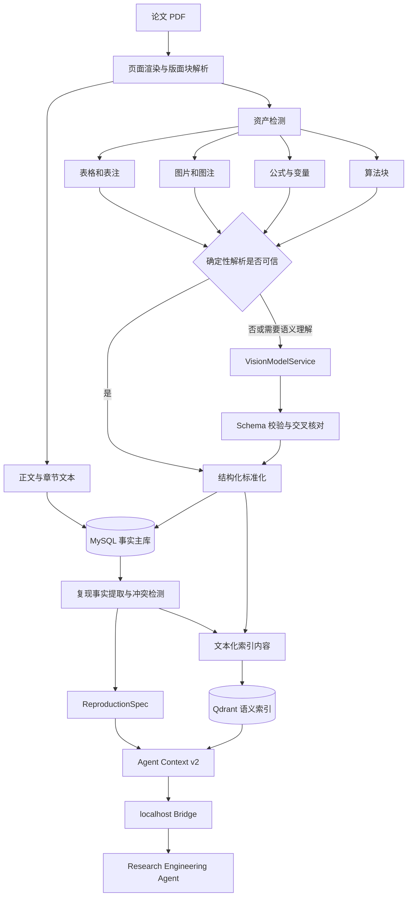

# 多模态论文复现证据层实施计划

> 计划状态：阶段 0—6 已完成，2026-07-28 正式归档<br>
> 计划日期：2026-07-27<br>
> 适用仓库：MyAgent，以及后续需要同步协议的独立 Research Engineering Agent<br>
> 核心原则：先建立可追溯的多模态证据层，再定向接入视觉模型；不让视觉模型替代全部确定性解析<br>
> 实施方式：一次只推进一个阶段，每个阶段验收通过后再进入下一阶段

## 1. 背景与问题

MyAgent 当前已经具备 PDF 文本解析、结构化切块、论文画像、章节摘要、多粒度 RAG，以及将论文上下文交给本地 Research Engineering Agent 生成最小复现代码的完整链路。

但当前“论文复现是否准确”的上限主要由文献加工质量决定，而不是由 Agent 模型能力决定。现有链路存在两次关键的信息损失。

### 1.1 PDF 输入阶段的信息损失

当前 `PdfParseServiceImpl` 使用 PDFBox `PDFTextStripper` 提取整篇纯文本。该实现适合具有正常文字层、版面相对简单的论文，但不能可靠保留：

- 表格的行、列、合并单元格和表头关系；
- 架构图、算法流程图和图中模块连接；
- 实验曲线、柱状图和热力图表达的趋势；
- 公式结构、上下标、特殊符号和变量定义；
- 页面坐标、图表区域以及正文和图注之间的对应关系；
- 双栏论文中严格正确的阅读顺序；
- 扫描版 PDF 中不存在文字层的内容。

因此，后续画像和章节摘要生成时看到的已经是残缺输入。模型无法总结它从未得到的表格数值、图中结构或公式细节。

### 1.2 Agent 上下文阶段的信息压缩

当前 `ResearchEngineeringContextServiceImpl` 生成论文复现上下文时，主要发送：

- 论文标题、摘要、关键词和备注；
- 一份 `paper-profile-v1` 论文画像；
- 最多 16 个 `section-summary-v1` 章节摘要；
- 每个章节摘要最多约 1800 字符。

当前实现没有把关键原文 Chunk、表格、图片、公式和精确页码作为独立证据发送给 Agent。即使原文中存在实现参数，也可能在章节摘要中被压缩掉。

现有问题可以概括为：

```text
PDF 中的正文、表格、图片和公式
→ 纯文本提取时丢失多模态结构
→ 画像与章节摘要再次压缩
→ Agent 上下文只选择摘要级证据
→ Agent 只能在缺失信息上做最小实现
```

### 1.3 为什么不能只增加一个视觉模型调用

如果没有统一的数据结构、页码定位、原始资产保存、版本和置信度字段，即使视觉模型生成了图片描述，也无法可靠回答以下问题：

- 描述对应论文中的哪一页、哪一张图；
- 数值是原文事实、OCR 结果还是模型推断；
- 资产是否已经重新处理、结果是否过期；
- 哪些内容可以作为 Agent 的确定事实；
- Qdrant 中的描述如何回查原始图片；
- 用户如何检查或修正模型输出；
- 视觉模型失败后如何重试或降级。

因此，本任务不是“给 PDF 解析增加一个 VLM”，而是建设一套面向论文复现的多模态证据基础设施。

## 2. 建设目标

本任务完成后，系统应当能够：

1. 按页解析论文并保留文本块、页码和页面坐标；
2. 识别并保存论文中的表格、图片、公式和算法块；
3. 优先使用确定性工具提取内容，只对低置信度或视觉语义资产调用视觉模型；
4. 将原始资产、结构化结果、语义描述、来源位置和处理版本保存到 MySQL；
5. 将适合语义检索的资产描述和复现事实写入 Qdrant；
6. 从正文、表格、图片、公式中构建可追溯的复现规格 `ReproductionSpec`；
7. 让 Agent 清楚区分原文事实、交叉验证结果、模型推断和缺失信息；
8. 在前端展示论文的多模态处理状态、资产详情、复现准备度和关键缺口；
9. 建立独立多模态评测集，量化资产检测、事实提取和 Agent 上下文质量；
10. 保持现有 16 篇/40 题 RAG 基线不回退。

## 3. 非目标

本阶段不承诺：

- 自动复现论文的完整训练结果；
- 自动下载大型数据集、模型权重或作者代码；
- 自动运行长时间训练、超参数搜索或消融实验；
- 对所有扫描件、复杂数学公式和任意版式达到 100% 解析准确率；
- 仅依靠视觉模型目测实验图中的精确数值；
- 将所有 PDF 页面无差别发送给视觉模型；
- 用多模态向量直接替换现有文本 Embedding 和 Qdrant 检索链；
- 在没有来源证据的情况下自动补齐论文未公开的参数；
- 在本任务中改造为多用户云端文件服务。

## 4. 设计原则

### 4.1 MySQL 继续作为事实主库

原始资产位置、结构化表格、公式、视觉描述、处理状态、版本和人工确认状态都保存在 MySQL。Qdrant 只保存可重建的语义索引。

### 4.2 确定性解析优先，视觉模型按需触发

正文、原生文字层、可解析表格和可提取图片优先由确定性程序处理。视觉模型只负责：

- 架构图和流程图的语义解释；
- 传统表格解析失败后的结构修复；
- 扫描页面和低质量图片的识别；
- 公式或实验图中需要视觉理解的内容；
- 解析置信度低于阈值的资产。

### 4.3 原始内容、结构化结果和模型解释分层保存

系统不能只保存视觉模型生成的一段描述。每个资产至少保留：

```text
原始 PDF 页面或裁剪图片
+ 确定性提取结果
+ 视觉模型结构化结果
+ 来源页码和坐标
+ 提取方法与版本
+ 验证状态
```

### 4.4 精确事实以 Precision 优先

论文复现中，一个错误学习率比缺失学习率更危险。对于超参数、维度、数据划分和公式等关键事实：

- 高置信度且有明确来源时进入复现事实；
- 多个来源冲突时保留冲突，不自动任选一个；
- 只有视觉模型推断时标记为待确认；
- 无法确认时进入 `missingInformation`，不作为论文事实发送。

### 4.5 所有 Agent 事实必须能够回溯

Agent 任务包中的实现事实必须关联：

- 论文 ID；
- 来源类型；
- 来源记录 ID；
- 页码；
- 图、表或公式标签；
- 必要时的页面坐标；
- 提取方法；
- 验证状态。

### 4.6 兼容现有文本链路

旧论文在未运行多模态处理时仍可继续使用现有 RAG 和论文复现能力。新增能力采用附加表、附加字段和新的内容类型，不直接破坏 `paper-profile-v1`、`section-summary-v1` 和现有 Qdrant 点。

## 5. 目标架构



## 6. 数据模型

最终字段以 migration 和实体实现为准。以下为实施时的目标模型。

### 6.1 `paper_asset`

保存论文中的原始多模态资产及其标准化内容。

| 字段 | 说明 |
| --- | --- |
| `id` | 资产主键 |
| `paper_id` | 所属论文 |
| `section_id` | 可选的所属章节 |
| `asset_type` | `TABLE`、`FIGURE`、`EQUATION`、`ALGORITHM`、`PAGE_IMAGE` |
| `asset_label` | `Table 2`、`Figure 3`、`Equation 5` 等 |
| `caption` | 图注、表注或公式上下文 |
| `page_start` / `page_end` | 来源页码 |
| `bounding_box_json` | 页面坐标，包含页宽高基准 |
| `raw_asset_path` | 项目数据目录中的相对路径，不保存任意外部绝对路径 |
| `raw_text` | OCR 或原生提取文本 |
| `structured_content_json` | 表格、公式、流程图等结构化结果 |
| `semantic_description` | 可用于问答和向量化的说明 |
| `extraction_method` | `PDF_NATIVE`、`TABLE_PARSER`、`OCR`、`VISION_MODEL`、`HYBRID` |
| `extraction_confidence` | 解析置信度，不能直接等同于模型自报置信度 |
| `verification_status` | `EXTRACTED`、`MODEL_INFERRED`、`CROSS_CHECKED`、`USER_CONFIRMED`、`REJECTED` |
| `content_hash` | 原始资产哈希，用于幂等和缓存 |
| `parser_version` | 资产检测与提取版本 |
| `analysis_version` | 视觉分析版本 |
| `qdrant_point_id` | 对应的向量点 |
| `create_time` / `update_time` | 时间字段 |

唯一性不能只依赖图表标签，因为有些论文标签缺失或重复。建议使用：

```text
paper_id + page_start + asset_type + content_hash + parser_version
```

### 6.2 `paper_reproduction_fact`

保存可以直接影响代码复现的原子事实。

| 字段 | 说明 |
| --- | --- |
| `id` | 事实主键 |
| `paper_id` | 所属论文 |
| `fact_type` | `ARCHITECTURE`、`ALGORITHM_STEP`、`HYPERPARAMETER`、`DATASET`、`PREPROCESSING`、`LOSS`、`METRIC`、`ENVIRONMENT` 等 |
| `fact_key` | 例如 `learning_rate` |
| `fact_value` | 例如 `0.001` |
| `unit` | 可选单位 |
| `conditions_json` | 适用模型、数据集、实验设置等条件 |
| `source_kind` | `RAW_CHUNK`、`TABLE`、`FIGURE`、`EQUATION`、`PROFILE`、`SUMMARY` |
| `source_id` | 来源记录 ID |
| `page_number` | 来源页码 |
| `evidence_excerpt` | 最小必要证据文本 |
| `confidence` | 系统综合置信度 |
| `verification_status` | 验证状态 |
| `conflict_group` | 多个来源冲突时的分组 |
| `extractor_version` | 事实提取版本 |

复现事实是派生数据，可以根据论文资产和原文重新生成，但必须保存来源。

### 6.3 `paper_reproduction_spec`

保存论文在某一版本下形成的完整复现规格。

| 字段 | 说明 |
| --- | --- |
| `id` | 主键 |
| `paper_id` | 所属论文 |
| `spec_json` | 结构化 `ReproductionSpec` |
| `source_revision` | 论文、Chunk、资产和事实的组合修订号 |
| `spec_version` | 规格 Schema 版本 |
| `critical_coverage` | 关键复现信息覆盖度 |
| `provenance_coverage` | 已有事实来源完整度 |
| `unresolved_conflict_count` | 未解决冲突数量 |
| `missing_critical_count` | 缺失关键字段数量 |
| `status` | `NOT_READY`、`PARTIAL`、`READY`、`NEEDS_REVIEW` |
| `create_time` / `update_time` | 时间字段 |

### 6.4 `paper_multimodal_job`

视觉模型调用耗时且可能失败，需要独立异步任务状态，而不能阻塞普通解析请求。

主要字段：

- `paper_id`；
- `job_type`：检测、确定性提取、视觉分析、事实构建、规格构建；
- `status`：等待、运行、部分成功、完成、失败、取消；
- `total_items`、`processed_items`、`failed_items`；
- `provider`、`model`；
- `error_message`；
- `started_at`、`finished_at`。

任务需要幂等：同一资产、同一内容哈希和同一分析版本不重复调用视觉模型。

## 7. 原始资产存储

资产文件建议保存在既有 `ResearchAssistantData/` 下，不进入 Git：

```text
ResearchAssistantData/
└── paper-assets/
    └── {paperId}/
        └── {sourceRevision}/
            ├── pages/
            │   └── page-0001.png
            ├── figures/
            │   └── figure-0001.png
            ├── tables/
            │   └── table-0001.png
            └── equations/
                └── equation-0001.png
```

数据库只保存相对路径。读取文件时必须：

1. 从受控数据根目录解析；
2. 规范化路径；
3. 验证最终路径仍在该论文资产目录内；
4. 禁止前端传入任意磁盘路径；
5. 删除论文时同时清理对应受控资产目录。

## 8. 多模态解析管道

### 8.1 页面级解析

在保留现有全文解析兼容性的前提下，新增页面级解析结果：

- 页面编号；
- 文本块顺序；
- 文本块 Bounding Box；
- 字体大小和基础版式特征；
- 页面宽高；
- 页面渲染图；
- 标题、正文、图注、表注和页眉页脚分类。

第一阶段不要求一次解决所有双栏和复杂版式，但必须建立页级定位，使后续证据可以回到原页面。

### 8.2 资产检测

资产检测需要识别：

- PDF 内嵌图片区域；
- `Figure/Fig.` 图注及其邻近区域；
- `Table` 表注及表格边界；
- 带编号或独立排版的公式区域；
- `Algorithm/Pseudocode` 算法块；
- 扫描页和低文本密度页。

检测结果先创建 `paper_asset`，即使分析失败也保留原始资产和来源位置。

### 8.3 表格处理

处理顺序：

1. 尝试读取 PDF 原生文字和绘制线；
2. 恢复行、列、表头和单元格；
3. 输出 Markdown 和结构化 JSON；
4. 检查行列数量、表头完整性、数值字符异常；
5. 低置信度时调用视觉模型修复结构；
6. 关键数值和单位与原生文本/OCR 交叉检查；
7. 无法确认的单元格标记为不确定，不自动补值。

视觉模型可以解释表格表达的结论，但关键数值以交叉核对后的结构化单元格为准。

### 8.4 图片与架构图处理

视觉模型针对图片输出受控 JSON：

```json
{
  "assetType": "FIGURE",
  "figureType": "MODEL_ARCHITECTURE",
  "purpose": "说明图的用途",
  "components": [],
  "connections": [],
  "inputs": [],
  "outputs": [],
  "implementationFacts": [],
  "trendClaims": [],
  "uncertainClaims": []
}
```

正文中的图注和引用该图的相邻段落必须一起提供给视觉模型，以减少脱离论文语境的误判。

对于实验曲线，视觉模型可以提取趋势和相对关系，但不能仅凭像素读取精确数值并标记为已验证事实。

### 8.5 公式处理

公式资产应尽可能生成：

- 公式标签；
- LaTeX 或规范化表达；
- 变量列表；
- 变量在相邻正文中的定义；
- 输入与输出；
- 公式用途；
- 所属算法步骤；
- 无法识别的符号列表。

公式解释可以由视觉模型辅助，但进入 Agent 任务包的数学表达必须保留原图、页码和验证状态。

### 8.6 扫描页和 OCR

只有在页面文本密度低、字符异常率高或确定为扫描页时触发 OCR。OCR 结果不能覆盖原生文本，而应作为独立提取结果保存，并记录所用引擎和版本。

## 9. 视觉模型服务设计

### 9.1 新增独立抽象

建议新增 `VisionModelService`，不要把图片请求强行塞入当前纯文本 `LlmService`：

```text
VisionModelService
├── analyzeFigure(...)
├── analyzeTable(...)
├── analyzeEquation(...)
└── analyzePage(...)
```

业务层只依赖统一 DTO，不依赖具体厂商的图片请求格式。Provider 实现负责：

- 图片编码或上传；
- 模型参数；
- 结构化输出模式；
- 超时与重试；
- 限流；
- Token/费用统计；
- 原始响应脱敏日志。

### 9.2 触发条件

满足以下任一条件时才调用视觉模型：

- 资产类型为架构图或流程图；
- 表格确定性解析失败；
- 页面缺少正常文本层；
- 公式提取不完整；
- 资产包含复现相关关键词且传统解析置信度低；
- 用户在前端显式要求重新分析。

不因为“页面中存在图片”就自动调用。Logo、装饰图、作者照片等低价值资产应过滤。

### 9.3 结果可信度

不能直接使用视觉模型自报的 confidence 作为最终置信度。系统综合考虑：

- Schema 是否完整；
- 图注和正文是否支持结果；
- OCR/原生文本是否一致；
- 同一数值是否在多个来源出现；
- 模型多次结果是否稳定；
- 用户是否确认。

### 9.4 缓存与版本

缓存键建议包含：

```text
asset content hash
+ prompt schema version
+ provider
+ model
+ analysis version
```

资产不变时避免重复花费；模型或 Prompt 升级后允许生成新版本，并保留旧结果用于比较和回滚。

## 10. Qdrant 索引设计

继续使用现有 `paper_chunks` Collection，第一版不引入原始图片向量。新增文本化内容类型：

| `contentType` | 向量化内容 | 用途 |
| --- | --- | --- |
| `TABLE_CONTENT` | 表注、表头、关键行列、结构化结论 | 查参数、实验结果、消融数据 |
| `FIGURE_DESCRIPTION` | 图注、结构描述、组件与连接 | 查架构和流程 |
| `EQUATION_DESCRIPTION` | 公式表达、变量和用途 | 查损失函数与算法定义 |
| `ALGORITHM_BLOCK` | 算法步骤和伪代码说明 | 查复现流程 |
| `REPRODUCTION_FACT` | 原子事实及适用条件 | 构建复现规格 |

Payload 至少包含：

- `paperId`；
- `assetId` 或 `factId`；
- `contentType`；
- `pageNumber`；
- `assetLabel`；
- `verificationStatus`；
- `parserVersion` / `analysisVersion`；
- `isMultimodal=true`。

向量召回只是候选选择。最终事实仍回查 MySQL，并检查验证状态。

### 10.1 检索隔离

普通 RAG 不应立即无条件混入所有资产，否则可能破坏现有 40 题基线。实施时分两步：

1. 多模态内容首先只供论文复现上下文和显式图表问题使用；
2. 完成独立评测后，再按问题意图为普通 RAG 增加资产候选池和证据配额。

### 10.2 版本兼容

现有 `PAPER_PROFILE`、`SECTION_SUMMARY` 和 `RAW_CHUNK` 保持不变。多模态资产完成后，再决定是否生成 `paper-profile-v2` 和 `section-summary-v2`。

在 v2 被完整回归验证之前，不能直接替换现有 v1 活跃版本。代码中现有硬编码版本需要逐步收敛到统一的版本配置或版本选择服务。

## 11. `ReproductionSpec` 设计

复现规格是论文知识库与 Agent 之间的核心中间层。建议 Schema 至少包含：

```json
{
  "schemaVersion": "reproduction-spec-v1",
  "paperId": 0,
  "goal": "",
  "problemDefinition": {},
  "inputs": [],
  "outputs": [],
  "architecture": {
    "components": [],
    "connections": []
  },
  "algorithmSteps": [],
  "equations": [],
  "datasets": [],
  "preprocessing": [],
  "hyperparameters": [],
  "trainingProcedure": [],
  "evaluationMetrics": [],
  "implementationEnvironment": [],
  "acceptanceHints": [],
  "evidence": [],
  "conflicts": [],
  "missingInformation": [],
  "readiness": {}
}
```

### 11.1 原子事实示例

```json
{
  "factType": "HYPERPARAMETER",
  "key": "learningRate",
  "value": "0.001",
  "conditions": {
    "dataset": "Dataset A",
    "model": "Proposed Model"
  },
  "source": {
    "kind": "TABLE",
    "sourceId": 152,
    "page": 9,
    "label": "Table 3"
  },
  "verificationStatus": "CROSS_CHECKED",
  "confidence": 0.98
}
```

### 11.2 冲突处理

如果正文写 `0.001`、表格写 `0.0001`，系统不自动选择，而是生成：

```json
{
  "key": "learningRate",
  "candidateValues": [],
  "reason": "正文与表格不一致",
  "status": "UNRESOLVED"
}
```

Agent 应把它视为阻塞或显式配置项，而不是论文确定参数。

### 11.3 准备度

准备度不应只有一个不透明总分，应至少展示：

- 关键架构是否存在；
- 输入输出是否明确；
- 核心算法步骤是否完整；
- 关键公式是否可读；
- 关键参数覆盖度；
- 数据集和预处理是否明确；
- 未解决冲突数量；
- 来源完整度；
- 多模态处理是否完成。

状态建议：

| 状态 | 含义 |
| --- | --- |
| `NOT_READY` | 解析或关键证据严重缺失 |
| `PARTIAL` | 可以生成框架，但存在重要假设 |
| `NEEDS_REVIEW` | 发现冲突或关键模型推断，等待用户确认 |
| `READY` | 最小复现所需核心信息满足当前门槛 |

`READY` 只表示适合生成最小实现，不表示能够复现论文指标。

## 12. Agent 上下文契约升级

### 12.1 当前契约问题

现有 `AgentEvidenceResponse` 只有：

```text
id、kind、title、content、sourceReference
```

它不能表达页码、资产类型、提取方法、验证状态、置信度和冲突。

### 12.2 v2 增量字段

为了兼容独立 Agent，采用添加字段而不是立即删除旧字段：

- `schemaVersion`；
- `paperId`；
- `sourceKind`；
- `sourceId`；
- `pageStart` / `pageEnd`；
- `assetLabel`；
- `contentFormat`；
- `extractionMethod`；
- `verificationStatus`；
- `confidence`；
- `isCritical`；
- `conflictGroup`。

`taskPackage` 新增：

- `reproductionSpec`；
- `criticalEvidence`；
- `missingInformation`；
- `conflicts`；
- `readiness`；
- `sourceRevision`。

### 12.3 证据选择策略

不能继续只按章节类型取前 16 个摘要。新策略为：

1. 强制加入论文基本信息和复现准备度；
2. 按 `ReproductionSpec` 的关键事实加入表格、图片、公式和原文证据；
3. 每个关键事实附最小证据，不重复发送长摘要；
4. 方法和算法证据优先于背景介绍；
5. 参数、输入输出、损失和预处理优先于通用贡献描述；
6. 冲突与缺失信息必须显式加入；
7. 最后才用章节摘要补充背景。

### 12.4 原文证据

新上下文必须直接查询关键 `PaperChunk`，而不是只依赖摘要。原文证据需要：

- 排除引用和噪声；
- 与复现事实或资产有关联；
- 保留章节和页码；
- 使用短摘录而非整章复制；
- 避免相同内容通过 Chunk、摘要和画像重复发送。

### 12.5 独立 Agent 同步

当 MyAgent 输出 v2 taskPackage 后，独立 Agent 需要同步：

- 解析新增字段；
- 把 `MODEL_INFERRED` 和低置信度事实放入假设；
- 对 `UNRESOLVED` 冲突停止自动确定参数；
- 在 handoff 中引用页码和资产；
- 记录哪些实现来自论文事实、哪些来自安全默认值；
- 保留 v1 taskPackage 的兼容读取能力。

MyAgent 和 Agent 的协议修改必须在同一阶段联调，不能只修改一侧。

## 13. 后端接口规划

接口名称可在实现前根据现有 Controller 风格微调。

### 13.1 资产处理

```text
POST /api/papers/{paperId}/assets/extract
POST /api/papers/{paperId}/assets/analyze
POST /api/papers/{paperId}/assets/reprocess
GET  /api/papers/{paperId}/assets
GET  /api/papers/{paperId}/assets/{assetId}
GET  /api/papers/{paperId}/assets/{assetId}/content
GET  /api/papers/{paperId}/assets/status
GET  /api/papers/{paperId}/assets/jobs/{jobId}
```

### 13.2 人工确认

```text
PUT  /api/papers/{paperId}/assets/{assetId}/analysis
POST /api/papers/{paperId}/assets/{assetId}/confirm
POST /api/papers/{paperId}/assets/{assetId}/reject
```

人工修改必须保留：

- 原模型结果；
- 修改后结果；
- 修改时间；
- 验证状态；
- 后续索引和规格需要重建的标记。

### 13.3 复现规格

```text
POST /api/papers/{paperId}/reproduction-spec/build
GET  /api/papers/{paperId}/reproduction-spec
GET  /api/papers/{paperId}/reproduction-readiness
```

现有：

```text
GET /api/papers/{paperId}/reproduction-context
```

保持兼容，并在准备好后增量返回 v2 taskPackage。

## 14. 前端规划

### 14.1 文献处理状态

在现有解析、原文向量、画像生成和画像索引之外增加“多模态证据”状态，但不要把所有子步骤压成一个模糊按钮。

建议展示：

- 资产检测状态；
- 表格/图片/公式数量；
- 确定性解析数量；
- 视觉分析数量；
- 失败和待确认数量；
- 复现规格状态；
- 当前版本。

### 14.2 论文资产页签

论文详情增加资产视图：

- 按 TABLE、FIGURE、EQUATION、ALGORITHM 筛选；
- 显示原图、页码和图表标签；
- 显示结构化内容与视觉描述；
- 显示提取方法和验证状态；
- 支持重新分析、修正、确认和拒绝；
- 点击后可跳转或打开对应 PDF 页。

### 14.3 复现准备度

“复现代码”入口之前展示：

- 当前是否只有文本证据；
- 多模态资产是否处理；
- 关键参数覆盖度；
- 未确认视觉事实数量；
- 未解决冲突；
- 关键缺失项；
- 本次 Agent 会使用的证据类型。

当状态为 `NOT_READY` 或 `NEEDS_REVIEW` 时，不强制禁止启动，但必须明确提示 Agent 将使用假设或可能被阻塞。

## 15. 分阶段实施

### 阶段 0：建立多模态评测基线

> 状态：已完成（2026-07-27）。固定语料、资产/事实页码标注、纯文本结构基线与复跑校验已落地；详见 [多模态复现评测基线](../../evaluation/multimodal-reproduction-baseline.md)。

#### 目标

在修改解析链路之前先建立可以量化的基线，避免完成视觉接入后只凭主观判断效果。

#### 工作内容

1. 从现有论文中选择 8—10 篇具有代表性的 PDF；
2. 覆盖原生表格、复杂表格、架构图、流程图、实验图、公式和双栏版式；
3. 人工标注关键资产及页码；
4. 标注最小复现需要的参数、公式、输入输出、预处理和算法步骤；
5. 记录当前纯文本链路能够提供多少信息；
6. 创建固定语料版本、用例和原始结果 JSON。

#### 验收

- 评测语料和标注文件可以重复使用；
- 每个标注事实有论文页码和来源类型；
- 已记录当前基线，不修改结果美化数字；
- 评测口径形成正式说明。

### 阶段 1：页面级溯源与资产数据基础

> 状态：已完成（2026-07-27）。已新增 `paper_asset` migration、受控页面渲染目录、页面/图注/表注资产记录及查询/内容接口；视觉模型和复杂结构化提取仍未接入。

#### 目标

先解决“证据来自哪里、原始资产存在哪里”，暂不接视觉模型。

#### 工作内容

1. 新增数据库 migration 和实体；
2. 新增受控资产目录；
3. 渲染页面图；
4. 保存页面编号、文本块和坐标；
5. 检测并裁剪基础图片、图注和表注区域；
6. 建立幂等、重处理和论文删除清理；
7. 增加后端查询接口和基础状态。

#### 验收

- 对选定论文能够列出页面和资产；
- 每个资产都能打开原图并定位页码；
- 重复处理不产生重复记录；
- 删除论文不会遗留受控资产；
- 现有解析、向量化和 40 题 RAG 不受影响。

### 阶段 2：确定性表格、公式和算法块提取

> 状态：已完成（2026-07-27）。已提供原生表格文本、公式邻近上下文与算法步骤候选，并以低置信度/待复核保存；资产查看、原页预览、确认与拒绝已接入文献管理页。复杂单元格恢复与视觉模型分析仍不在本阶段范围内。

#### 目标

在不依赖视觉模型的情况下先提取可可靠获得的结构化信息。

#### 工作内容

1. 表格行列与表头恢复；
2. 表格 Markdown/JSON 输出；
3. 公式区域、编号和邻近变量定义关联；
4. 算法块和伪代码区域提取；
5. 解析质量规则与置信度；
6. 前端资产查看和人工修正；
7. 新增资产级单元测试和真实 PDF 测试夹具。

#### 验收

- 原生表格能够保留关键行列关系；
- 公式、表格和算法块具有页码及原始资产；
- 低质量结果被标记，不伪装成高可信事实；
- 人工修改后能够触发派生数据失效；
- 评测报告记录确定性解析结果。

### 阶段 3：定向视觉模型处理

> 状态：已完成（2026-07-27）。Qwen-VL 已通过独立服务抽象接入，并完成复现相关门控、固定 JSON Schema 校验、两次失败重试、版本缓存、任务状态、失败回退和前端分析入口；真实结果见[阶段 3 验证报告](../../evaluation/reports/multimodal-vision-stage3-2026-07-27.md)。

#### 目标

补齐架构图、流程图、扫描页和低置信度资产。

#### 工作内容

1. 新增 `VisionModelService` 和 Provider 实现；
2. 建立图、表、公式的 JSON Schema；
3. 实现触发门控；
4. 实现超时、重试、限流和失败回退；
5. 实现内容哈希缓存和版本管理；
6. 将图注和相邻正文与图片共同输入；
7. 执行 Schema 校验和跨来源核对；
8. 增加模型调用量、耗时和失败率观测。

#### 验收

- 不会对装饰图片和全部页面无差别调用；
- 输出必须通过 Schema 校验后才能保存；
- 关键数字不会仅凭视觉推断标为已确认；
- 相同资产相同版本不会重复付费调用；
- Provider 失败不会破坏原始资产和文本链路；
- 能在前端区分确定性结果与模型推断。

### 阶段 4：复现事实与多模态索引

> 状态：已完成（2026-07-27）。已实现原文与资产的保守事实抽取、来源保留、相同事实合并、冲突分组、独立 Qdrant collection、批量 Qwen Embedding、MySQL 回查和前端事实面板；真实结果见[阶段 4 验证报告](../../evaluation/reports/multimodal-reproduction-facts-stage4-2026-07-27.md)。

#### 目标

把解析结果转化为可检索、可验证的复现事实。

#### 工作内容

1. 新增 `paper_reproduction_fact`；
2. 从原文、表格、图片和公式抽取原子事实；
3. 实现条件、单位、来源和验证状态；
4. 实现相同事实合并与冲突检测；
5. 新增 Qdrant 多模态文本内容类型；
6. 回查 MySQL 后再使用事实；
7. 仅在显式图表问题和复现链路启用新索引。

#### 验收

- 关键事实 100% 具有来源记录；
- 冲突事实不会被自动合并成单一真值；
- Qdrant 点可回查原始资产；
- 删除或重处理资产会同步失效相关事实与向量；
- 普通 RAG 固定基线无明显回退。

### 阶段 5：ReproductionSpec 与 Agent Context v2

> 状态：已完成（2026-07-27）。MyAgent、独立 Agent v2、本地 Bridge、Paper 13/38 最小代码交付、smoke check 和分级 handoff 已验收。

#### 目标

让本地 Agent 获得准确、分级且能够回溯的复现信息。

#### 工作内容

1. 构建并持久化 `ReproductionSpec`；
2. 计算准备度、覆盖度、冲突和缺失项；
3. Agent 上下文直接加入关键原文和多模态事实；
4. `AgentEvidenceResponse` 增量升级；
5. `taskPackage` 增加规格、冲突和缺口；
6. 独立 Agent 支持 v2 协议；
7. handoff 展示论文事实、模型推断和安全默认值；
8. 前端增加复现准备度和证据预览。

#### 验收

- Agent 接收到的所有论文事实都有来源；
- 低置信度和冲突事实不会被当成确定参数；
- 关键原文不再只通过章节摘要间接提供；
- v1 上下文仍能被旧 Agent 兼容读取；
- 使用至少 2 篇多模态论文完成端到端最小复现；
- handoff 能说明实现依据和缺失信息。

### 阶段 6：综合回归与正式发布

#### 目标

量化多模态证据层是否真正改善复现输入，而不是只增加功能。

#### 工作内容

1. 运行固定多模态评测；
2. 对比纯文本和多模态任务包；
3. 运行现有 16 篇/40 题 RAG 回归；
4. 记录视觉模型成本和耗时；
5. 验证失败重试、删除、重处理和版本升级；
6. 更新架构、产品、API、数据库和项目介绍文档；
7. 将本活动计划移入归档。

#### 验收

- 所有正式指标保留原始 JSON；
- 达到本计划第 16 节的发布门槛；
- 没有把目标值写成已达到结果；
- 文档链接检查、后端测试和前端测试通过；
- 用户完成真实论文复现验收。

#### 完成结果

阶段 6 已于 2026-07-28 完成。固定 8 篇评测达到 24/24 资产锚点、54/56 关键事实、8/8 关键数值、100% 来源完整和 100% 冲突暴露；16 篇/40 题 RAG 回归全部成功。详细口径见[多模态复现证据层发布评测](../../evaluation/reports/multimodal-reproduction-release-2026-07-28.md)。

## 16. 评测方案

以下数字是发布目标，不是当前已经取得的结果。

### 16.1 数据集

初始固定多模态语料建议包括：

- 8—10 篇真实论文；
- 至少 20 个表格；
- 至少 20 张架构图、流程图或结果图；
- 至少 15 个关键公式；
- 至少 50 条人工标注的复现事实；
- 至少 2 篇扫描或低文本质量论文作为困难样例。

如果现有 16 篇论文不能覆盖这些类型，可以新增专用评测论文，但必须固定版本和哈希。

### 16.2 指标

| 指标 | 含义 | 初始发布目标 |
| --- | --- | --- |
| 资产检测 Recall | 标注图表公式中成功发现的比例 | ≥ 90% |
| 资产检测 Precision | 检测结果中真实有效资产比例 | ≥ 90% |
| 来源定位准确率 | 页码、标签与原始资产是否正确 | 100% |
| 关键表格数值 Precision | 提取关键数值中正确的比例 | ≥ 95% |
| 关键复现事实 Recall | 标注复现事实被系统发现的比例 | ≥ 90% |
| 事实来源完整率 | 进入任务包的事实是否都有来源 | 100% |
| 未支持事实率 | 被当成论文事实但没有证据的比例 | 0% |
| 冲突暴露率 | 人工标注冲突是否被识别并暴露 | 100% |
| Agent 基础检查成功率 | 最小项目是否通过记录的短检查 | 作为前后对比指标 |
| 单篇视觉处理耗时/调用量 | 成本与性能 | 记录基线，不先虚构阈值 |

### 16.3 对比组

至少保留两组：

```text
Baseline：摘要 + 画像 + 章节摘要
Candidate：关键原文 + 多模态资产 + ReproductionSpec
```

同一篇论文、同一个最小复现目标和同一 Agent 配置下比较：

- 获取到的关键事实数量；
- 错误或无来源事实数量；
- Agent 产生的假设数量；
- 代码结构是否与论文证据一致；
- 基础检查是否通过；
- 人工修正次数。

### 16.4 现有 RAG 回归

多模态索引不能以破坏现有问答效果为代价。每个影响检索的阶段都要继续运行：

- 16 篇/40 题固定评测；
- source Recall / Precision；
- 路由策略准确率；
- reference/noise 污染率；
- 三粒度证据使用率；
- 延迟和失败率。

## 17. 失败、回退与一致性

### 17.1 视觉模型失败

- 原始资产仍然保存；
- 状态标记为失败或待分析；
- 不影响现有纯文本 RAG；
- 支持按失败资产重试；
- 不因为一个资产失败导致整篇任务完全回滚；
- `ReproductionSpec` 标记为 `PARTIAL`。

### 17.2 资产重新处理

重新处理需要生成新的 `sourceRevision`。旧的：

- 资产分析；
- 复现事实；
- ReproductionSpec；
- Qdrant 点；
- Agent 上下文修订；

必须被标记过期或重新构建，不能静默混用。

### 17.3 删除论文

删除流程需要覆盖：

- `paper_asset`；
- `paper_reproduction_fact`；
- `paper_reproduction_spec`；
- 多模态任务记录；
- Qdrant 对应点；
- 受控资产目录。

本地 Agent 已经创建的代码项目不自动删除，只在项目索引中说明来源论文已不存在。

### 17.4 幂等

每个阶段必须支持重复调用。幂等依据包括：

- paper ID；
- PDF 文件哈希；
- 资产内容哈希；
- parser/analysis/spec 版本；
- source revision。

## 18. 安全与隐私

1. 视觉模型调用前明确哪些页面或裁剪图片会被发送到外部 Provider；
2. 默认只发送最小必要资产，不上传整篇 PDF；
3. API Key 继续通过本地配置或环境变量管理，禁止写入数据库和日志；
4. 原始模型响应日志需要限制长度并避免保存凭据；
5. 资产读取接口不能接受用户提供的任意路径；
6. MyAgent 同步给 Agent 的仍是证据和受控相对引用，不同步服务器内部绝对路径；
7. 如果未来支持敏感论文，需增加“禁止外部视觉模型”配置，只运行本地解析/OCR。

## 19. 预期代码影响范围

实施时预计涉及：

```text
backend/research-assistant-backend/
├── pom.xml
└── src/main/java/com/myagent/assistant/
    ├── paper/
    │   ├── asset/
    │   ├── entity/
    │   ├── mapper/
    │   ├── service/
    │   └── controller/
    ├── vision/
    │   ├── dto/
    │   ├── service/
    │   └── provider/
    ├── qdrant/
    └── researchengineering/

frontend/research-assistant-frontend/src/
├── api/
├── components/paper-assets/
├── views/PaperManagementView.vue
└── researchEngineering/

docs/
├── architecture/
├── database/
├── evaluation/
├── product/
└── status/

test/
├── fixtures/multimodal-papers/
├── multimodal-evaluation-cases.json
└── results/
```

数据库新增 migration，不能直接只修改全量 `schema.sql`。功能稳定后再同步全量 Schema。

## 20. 测试策略

### 20.1 单元测试

- 页面块排序；
- 图表标签识别；
- Bounding Box 合法性；
- content hash 和幂等；
- 表格 JSON 校验；
- Vision Schema 解析；
- 置信度与验证状态转换；
- 事实合并和冲突检测；
- ReproductionSpec 准备度；
- Agent v1/v2 DTO 兼容。

### 20.2 集成测试

- PDF → 页面 → 资产 → MySQL；
- 资产 → 视觉分析 → 事实；
- 事实 → Qdrant → MySQL 回查；
- 规格构建和版本失效；
- 删除论文后的数据库、索引和文件清理；
- 视觉 Provider 超时与部分失败；
- Agent Context v2 与本地 Bridge。

### 20.3 真实联调

- 原生文本型论文；
- 双栏论文；
- 包含复杂表格的论文；
- 包含架构图的论文；
- 包含关键公式的论文；
- 扫描或低文本密度论文；
- 至少 2 篇真实论文的 Agent 最小复现。

## 21. 风险与控制

| 风险 | 影响 | 控制方式 |
| --- | --- | --- |
| 视觉模型对数字产生幻觉 | Agent 使用错误参数 | 数值交叉核对，模型推断不直接升级为确认事实 |
| 解析库对复杂 PDF 兼容性差 | 资产漏检 | 固定困难样例、低置信度回退和人工补录 |
| 全量页面调用成本过高 | 处理慢且费用不可控 | 资产级门控、缓存和最小裁剪 |
| 新内容类型污染普通 RAG | Recall/Precision 回退 | 初期只用于复现和显式图表问题，保留固定回归 |
| 多版本数据混用 | 任务包证据不一致 | sourceRevision、内容哈希和统一版本选择 |
| MyAgent 与 Agent 协议不同步 | 本地执行失败 | v2 增量字段、兼容测试和同阶段联调 |
| 人工确认被后续处理覆盖 | 用户修正丢失 | 原结果与人工版本分离，确认版本优先且可审计 |
| 资产文件无限增长 | 本地空间膨胀 | 版本清理策略、论文删除清理和缓存统计 |

## 22. 实施顺序与阶段边界

后续开始开发时严格按以下顺序：

```text
阶段 0 评测基线
→ 阶段 1 页面溯源与资产基础
→ 阶段 2 确定性提取
→ 阶段 3 定向视觉模型
→ 阶段 4 复现事实与索引
→ 阶段 5 Agent Context v2
→ 阶段 6 综合回归
```

不能跳过阶段 0 直接接视觉模型，也不能在没有来源定位和版本机制时把模型描述发送给 Agent。

每完成一个阶段：

1. 更新本计划阶段状态；
2. 更新 `docs/status/current.md`；
3. 保留测试和原始评测结果；
4. 给用户报告改动、验证、限制和 Git 版本；
5. 等待用户验收后再进入下一阶段。

## 23. 实施前默认决策

为了后续可以直接开始第一阶段，暂定以下默认方案：

1. 保留 PDFBox 作为 Java 主解析入口；
2. 第一阶段优先建立页码、坐标、页面渲染和资产存储，不立即替换整套 PDF 解析；
3. 视觉能力通过独立 `VisionModelService` 抽象接入；
4. 原始图片存受控本地目录，MySQL 保存相对路径；
5. Qdrant 只索引文本化资产和复现事实，不在第一版引入图像向量；
6. 多模态索引初期只影响论文复现和显式图表问题；
7. Agent 协议采用向后兼容的 v2 增量字段；
8. 无来源或只有低置信度推断的内容不作为确定论文事实；
9. 用户确认内容优先于自动重新分析结果；
10. 第一项代码任务从“阶段 0：固定评测语料与标注 Schema”开始。

## 24. 完成定义

只有同时满足以下条件，整个任务才算完成：

- 论文图、表、公式和算法块能够成为可查看的数据库资产；
- 关键资产具备页码、坐标、原始文件、提取方法和验证状态；
- 视觉模型按门控调用并支持缓存、失败回退和版本；
- 复现事实能够跨正文和多模态资产形成并暴露冲突；
- `ReproductionSpec` 能明确展示覆盖度、缺失和准备度；
- Agent Context v2 直接提供关键原文和多模态证据；
- 独立 Agent 能区分论文事实、模型推断和安全默认值；
- 多模态固定评测达到发布门槛；
- 现有 RAG 固定基线没有不可接受回退；
- 至少两篇真实多模态论文完成最小复现验收；
- 架构、API、数据库、评测和当前状态文档已更新；
- 本计划移动到 `docs/archive/plans/`。
